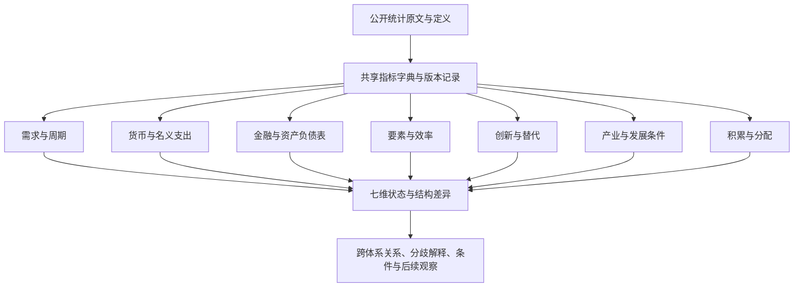

# 中国经济全景研究方法手册

版本：1.0 · 方法与来源核验截止：2026年9月15日

## 1. 使用目的

这套框架用于持续观察中国经济。七套体系分别回答它们擅长的问题，再将答案放入共同的部门、行业、地域和居民结构中解释。研究者应能从任一结论追溯到问题、指标、公开原文及适用口径。

本包是方法、指标元数据和研究模板。样例使用若干已核验公开数据验证计算与论证步骤，报告期并不相同，不能拼成一期“中国经济现状报告”。

### 推荐阅读顺序

1. 先看“体系问题”，选定本期必须回答的问题及比较期间。
2. 通过“问题—指标映射”找到证据，再检查“指标字典”和“维度覆盖”。
3. 在“来源登记”读取对应公开原文，记录原始值及发布版本。
4. 按七份分体系模板分别写事实、解释、反向证据和边界。
5. 使用全景模板连接七套答案，并列保留未解决分歧。

## 2. 架构与研究单位

### 三个层次不能混为一谈

- **指标定义**：例如居民人均可支配收入，明确含义、单位、范围和频率。
- **细分序列**：该指标在某地区、群体、期间及版本下形成的序列。某省有总居民收入，并不等于同时存在各城市收入五等份数据。
- **研究判断**：例如某一时期收入改善是否较广泛。需要多项、适用范围匹配的证据。

“指标数”不包括同一指标的每个同比、环比、移动平均展示。“细分序列数”只在成员、口径和时间覆盖已经明确时统计，本版未采集全历史面板，不给出推测的序列总量。覆盖矩阵行数表示问题与指标的可用范围检查次数。

## 3. 论证方法

每个问题按以下顺序记录：

**问题 → 机制假说 → 可观察事实 → 支持证据 → 反向证据与替代解释 → 当前允许的判断 → 仍不能回答的部分 → 下一条判别证据。**

### 证据充分程度

| 状态 | 含义 | 使用条件 |
|---|---|---|
| 多环节支持 | 机制环节与结果环节相互印证，已检查主要反向证据 | 至少包含机制和结果两个证据块；不把共享原值衍生项当作独立来源 |
| 部分支持 | 部分环节支持，其他环节缺失、滞后或范围较窄 | 明确哪一环节、哪一群体尚无依据 |
| 相互矛盾 | 可比性排查后，证据仍指向不同机制或群体 | 保留分歧，写明需要什么数据区分解释 |
| 证据不足 | 缺少关键变量、定义不匹配或历史过短 | 不生成方向明确的机制结论 |

这四类是研究记录规范，不是概率、显著性等级或预测准确率。结论的状态和变化方向也要分列：高位改善、低位恶化等不能仅凭增速符号混成“好/坏”。

### 比较与边界

优先使用同口径同比、发布方季调环比及可比长期结构。PMI的50是扩散指数分界，不是经济整体繁荣阈值。未经历史验证不设置危机红线，不由单次波动产生危机概率。

公开观察数据允许比较和提出机制解释。政策作用通常同时面临反向因果、共同冲击和时滞。本版不做因果识别模型，采用“若……且……，则更支持……”的条件表达，并保留替代解释。

## 4. 公共数据与计算规范

### 4.1 入选与来源

入选指标需要公开原文可访问、发布主体明确、定义或附注可核对，以及连续发布记录或明确发布制度。官方年鉴中的周期性资料可作为结构证据，注明其实际年份。公开统计不代表每一明细均免费取得；无法核验的细分不入已覆盖状态。

同一指标有多个发布版本时，保存原版本并优先采用同口径的正式或修订版本。官方转载原文须同时说明原发布者与托管站点。不同网站同文不能算作独立证据。

### 4.2 五项口径检查

| 检查 | 必须区分 | 常见错误 |
|---|---|---|
| 时间 | 报告期、发布日期、读取日；当期与累计 | 用发布日期代表经济发生时间；累计增速相减求单月增速 |
| 价格 | 当年价、不变价、价格指数、实际增速 | 名义收入改善被称为购买力改善 |
| 对象 | 全国、省全域、地市全域、市辖区、市本级财政 | 用市本级预算分母计算全市债务压力 |
| 样本 | 全部、规上、限上、城镇单位、住户调查 | 把规上工业利润当作全体企业利润 |
| 核算 | 存量、流量、资产价格、扩散指数 | 把债务/收入称为当期还本付息比例 |

### 4.3 透明计算

每个派生指标登记输入编号、选择的细分、公式和分母条件。分子分母需币种、期间、地域和部门范围匹配。输入不存在时结果留空并注明原因；实际零值保留。对显示精度的舍入只在输出时进行。

可以计算占比、差额、同比、同口径比率。GDP平减变化需要同版名义增长和实际增长；货币流通速度如使用年度GDP/平均货币存量，需要定义平均存量的观察频率，不能把期末存量与平均存量混用。本版未具备所需匹配输入的派生项不强行登记为已覆盖。

不自行构建资本存量、TFP、产出缺口、潜在增速、隐性债务和危机概率。可以用劳动生产率、产能利用、财政压力等提供部分线索，明确它们不是上述变量的等价替代。

### 4.4 需要特别保留的定义

- **社零与消费**：社零不覆盖全部服务消费，也不是国民核算最终消费。
- **固定资产投资与资本形成**：二者对象和核算方法不同，不互作同义词。
- **资金流量“实际最终消费”**：这里的“实际”表示最终受益归属，不是剔除价格；与实物社会转移相连。
- **储蓄与存款**：国民核算储蓄是收入扣除最终消费后的余额，存款增量还受到资产配置和部门转移影响。
- **债务与偿付**：负债余额不包括其现金到期安排，不能直接替代偿债负担。
- **劳动生产率与TFP**：前者也受资本深化、工时与行业构成影响。
- **统计利润与理论利润率**：规上工业营业收入利润率不是全社会资本回报率，也不是理论剩余价值率。
- **分类与总量**：高技术、战略性新兴及其他专题产业可能交叉，未经去重不相加。

### 4.5 修订与历史判断

按同版可比序列比较。M1、分年龄失业率、网络零售范围、住户季度与年度覆盖、人口/经济普查修订等依指标字典逐项处理。历史上当时能作出的判断只能使用当时已发布版本；如果未保存旧版本，就不声称完成了实时历史回测。

## 5. 全面细分的组织方式

### 地域

全国主线采用内地统计口径，31省均进入研究目录，直辖市单列比较层级。地级层级区分地级市、地区、自治州、盟。市辖区与地市全域、市本级财政与全市财政分别保留。

本版逐项检查指标的全国、省级和地级适用性，并核验年鉴中的31省GDP、收入及地区行业交叉表。2024年底行政区划表的地级数量仅作为该版本研究边界。城市统计制度范围不能证明每个城市的全部指标都已公开或已采集；地级未取得稳定公开序列的单元在矩阵标示。

### 行业与企业

以GB/T4754—2017及第1号修改单为基本分类，建立A—T门类目录，指标实际可细分到哪一层以来源为准。制造业等已有明细按原表行业名称记录。专题产业采用附加标签，不能与门类互斥分类混加。国际组织门类属于标准目录，是否有适用国内指标单独判断。

国有控股、私营、登记注册类型、规模与规上范围分别保留；“民间投资”不能当作“私营企业投资”的完全等价口径。企业法人数量不直接解释为活跃经营企业数量或净进入率。

### 居民与机构部门

居民按公开的城乡、五等份、年龄、就业身份分类。收入五等份边界随样本分布变化，不能追踪为固定同一群体，也不能据此推算财富分布或城市分位值。

机构部门包括住户、非金融企业、金融机构、广义政府和国外。政府部门不等同所有国有企业。分部门账户能够连接收入、消费、储蓄与投资，但核算恒等关系本身不证明因果。

## 6. 七套体系的问题与判断规则

下列每个问题都与工作簿中的问题编号一致。指标可以共享，判断规则按问题分别定义。

<!-- SYSTEM_CHAPTERS -->

## 7. 如何综合成经济全景

### 7.1 七维状态摘要

每套体系填写：适用期间、当前状态、变化方向、核心事实、证据充分程度、主要分化和未覆盖部分。全景不取平均分；财政、创新、就业可能处于不同节奏。

### 7.2 跨体系关系

固定检查四条关系链，允许根据本期证据增加关系：

1. **居民链**：就业/分配→收入→消费→企业销售→生产与再投资。
2. **金融链**：货币条件→融资取得→支出→收入现金流→偿债→金融机构。
3. **地产财政链**：住房成交/回款→开发活动与土地收入→财政和项目支出→企业回款与债务。
4. **结构链**：教育/研发/基础设施→技术应用和产业配置→效率/利润→就业与收入分配。

每条连线记录“已观察同向变化、机制假说、证据不足”之一；不把整张关系图自动认定为因果网络。

### 7.3 分歧处理顺序

先查口径与版本，再查期间和时滞，再查行业、地区、群体和部门差异，最后比较竞争性机制。仍不能排除的分歧保留。若需求证据弱、创新证据强，首先检查一个是全国当期支出、另一个是部分行业多年成果，二者不必矛盾。

每项分歧必须写：涉及问题编号、共同原始证据、各自新增证据、已排除的口径原因、未解决原因、下一项判别证据。不得通过删去不一致指标取得一致结论。

### 7.4 条件推论与观察清单

使用“如果订单和销售改善持续，同时库存与回款改善，则需求修复解释获得更多支持”这类可被后续数据推翻的句子。政策含义必须说明目标、机制条件、可能代价和缺少的证据。本版不生成确定性政策效果或量化预测。

## 8. 持续研究流程

| 节奏 | 工作 | 保留内容 |
|---|---|---|
| 月度 | 更新已发布的需求、货币、地产、价格和企业数据；记录与原判断的差异 | 低频结论标注原报告期，不把旧值伪装成当月事实 |
| 季度 | 完成七套答案及全景；核对跨体系分歧和条件变化 | 证据清单、共享证据关系、报告截止日与修订记录 |
| 年度 | 复核行业、人口、创新、分配与部门账户；清理过时定义 | 指标增删原因、来源可用性、分类版本和覆盖缺口 |

新增指标需说明补充了哪个问题和哪一环节；删除指标需记录停发、改口径、重复或信息价值下降的理由。停发后保留历史，不能换成不同指标后沿用原编号。

## 9. 模板、核验与交付边界

工作簿的八张表及CSV采用同一份结构化目录生成，编号可连接。七份分体系模板和全景模板中的“待填”是有意保留的研究输入区，不代表本版已有当期判断。

方法样例及验收说明见[样例与验收](validation/样例与验收.md)。覆盖缺口见[覆盖缺口](覆盖缺口.md)。原始材料地址及具体表、行、脚注保留在来源登记中。相关公开源的局部样本核验并不构成全部年份数值审计。

本版重点完成元数据、问题连接和判断方法。尚未建设全历史数据库、定时采集、实时预测、城市信用评分或自动生成经济结论的模型。
