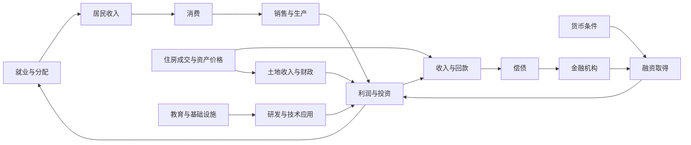

# 中国经济全景模板

> 模板没有预设当前经济状态。先完成七份独立答案，再做跨体系综合。

- 报告季度与信息截止日：待填
- 月度补充覆盖到：待填
- 年度结构指标实际报告期：待填
- 本次新增/修订的数据及受影响判断：待填

## 一、七维状态摘要

| 体系 | 核心答案（对应问题ID） | 状态 | 方向 | 证据充分程度与理由 | 适用期间 | 地域/行业/群体差异 | 未覆盖部分 |
|---|---|---|---|---|---|---|---|
| K 需求与周期 | 待填 | 待填 | 待填 | 待填 | 待填 | 待填 | 待填 |
| M 货币与名义支出 | 待填 | 待填 | 待填 | 待填 | 待填 | 待填 | 待填 |
| F 金融周期与资产负债表 | 待填 | 待填 | 待填 | 待填 | 待填 | 待填 | 待填 |
| G 要素与效率 | 待填 | 待填 | 待填 | 待填 | 待填 | 待填 | 待填 |
| I 创新与替代 | 待填 | 待填 | 待填 | 待填 | 待填 | 待填 | 待填 |
| S 产业与发展条件 | 待填 | 待填 | 待填 | 待填 | 待填 | 待填 | 待填 |
| D 积累与分配 | 待填 | 待填 | 待填 | 待填 | 待填 | 待填 | 待填 |

## 二、跨体系关系图

下图是待检验机制目录。每条连线应在下表标注观察性质，不能直接当作已识别的因果关系。

| 关系ID | 起点→终点 | 相关问题ID | 匹配证据与报告期 | 观察性质 | 时滞假说 | 替代解释/反馈 | 尚缺数据 |
|---|---|---|---|---|---|---|---|
| L1 | 就业/分配→收入→消费 | D2/D3/K3/K2 | 待填 | 待填 | 待填 | 待填 | 待填 |
| L2 | 融资→支出→回款→偿债 | M3/M4/F2 | 待填 | 待填 | 待填 | 待填 | 待填 |
| L3 | 住房→开发回款/土地→财政 | F3/K4/F4 | 待填 | 待填 | 待填 | 待填 | 待填 |
| L4 | 要素/创新→产业回报→就业 | G1/I2/I3/S4/I4 | 待填 | 待填 | 待填 | 待填 | 待填 |

观察性质仅填：已观察联系、待检验机制、证据不足。反馈另写，不能用图的箭头代替证据。

## 三、分歧解释表

| 分歧ID | 两项结论与问题ID | 共用证据 | 各自新增证据 | 口径/版本排查 | 时间尺度与时滞 | 群体/地区/行业解释 | 竞争性机制 | 下一项判别数据 |
|---|---|---|---|---|---|---|---|---|
| 待填 | 待填 | 待填 | 待填 | 待填 | 待填 | 待填 | 待填 | 待填 |

允许短期需求弱、部分产业升级、部分部门偿债压力升高同时成立。不投票、不加权生成总分。

## 四、条件与后续观察

| 判断ID | 若什么变化出现则增强 | 若什么变化出现则推翻 | 等待什么数据/报告期 | 发布节奏 | 责任人 | 条件政策推论与代价 |
|---|---|---|---|---|---|---|
| 待填 | 待填 | 待填 | 待填 | 待填 | 待填 | 待填 |

## 五、证据账本与覆盖声明

| 证据组ID | 底层原值/调查 | 被哪些体系使用 | 派生关系 | 是否同一报告版本 | 不能覆盖的范围 |
|---|---|---|---|---|---|
| 待填 | 待填 | 待填 | 待填 | 待填 | 待填 |

全国、省级、地级、行业、企业、居民群体及机构部门覆盖分别声明；低频资料保留原报告期。更新前对照指标字典的口径断点及缺口表。
