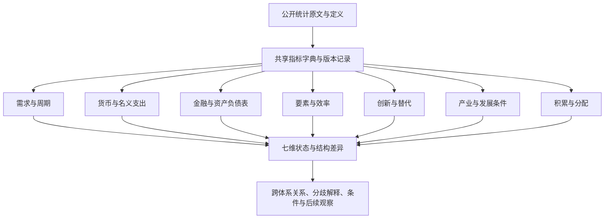

# 中国经济全景研究方法手册

版本：1.0 · 方法与来源核验截止：2026年9月15日

## 1. 使用目的

这套框架用于持续观察中国经济。七套体系分别回答它们擅长的问题，再将答案放入共同的部门、行业、地域和居民结构中解释。研究者应能从任一结论追溯到问题、指标、公开原文及适用口径。

本包是方法、指标元数据和研究模板。样例使用若干已核验公开数据验证计算与论证步骤，报告期并不相同，不能拼成一期“中国经济现状报告”。

### 推荐阅读顺序

1. 先看“体系问题”，选定本期必须回答的问题及比较期间。
2. 通过“问题—指标映射”找到证据，再检查“指标字典”和“维度覆盖”。
3. 在“来源登记”读取对应公开原文，记录原始值及发布版本。
4. 按七份分体系模板分别写事实、解释、反向证据和边界。
5. 使用全景模板连接七套答案，并列保留未解决分歧。

## 2. 架构与研究单位

### 三个层次不能混为一谈

- **指标定义**：例如居民人均可支配收入，明确含义、单位、范围和频率。
- **细分序列**：该指标在某地区、群体、期间及版本下形成的序列。某省有总居民收入，并不等于同时存在各城市收入五等份数据。
- **研究判断**：例如某一时期收入改善是否较广泛。需要多项、适用范围匹配的证据。

“指标数”不包括同一指标的每个同比、环比、移动平均展示。“细分序列数”只在成员、口径和时间覆盖已经明确时统计，本版未采集全历史面板，不给出推测的序列总量。覆盖矩阵行数表示问题与指标的可用范围检查次数。

## 3. 论证方法

每个问题按以下顺序记录：

**问题 → 机制假说 → 可观察事实 → 支持证据 → 反向证据与替代解释 → 当前允许的判断 → 仍不能回答的部分 → 下一条判别证据。**

### 证据充分程度

| 状态 | 含义 | 使用条件 |
|---|---|---|
| 多环节支持 | 机制环节与结果环节相互印证，已检查主要反向证据 | 至少包含机制和结果两个证据块；不把共享原值衍生项当作独立来源 |
| 部分支持 | 部分环节支持，其他环节缺失、滞后或范围较窄 | 明确哪一环节、哪一群体尚无依据 |
| 相互矛盾 | 可比性排查后，证据仍指向不同机制或群体 | 保留分歧，写明需要什么数据区分解释 |
| 证据不足 | 缺少关键变量、定义不匹配或历史过短 | 不生成方向明确的机制结论 |

这四类是研究记录规范，不是概率、显著性等级或预测准确率。结论的状态和变化方向也要分列：高位改善、低位恶化等不能仅凭增速符号混成“好/坏”。

### 比较与边界

优先使用同口径同比、发布方季调环比及可比长期结构。PMI的50是扩散指数分界，不是经济整体繁荣阈值。未经历史验证不设置危机红线，不由单次波动产生危机概率。

公开观察数据允许比较和提出机制解释。政策作用通常同时面临反向因果、共同冲击和时滞。本版不做因果识别模型，采用“若……且……，则更支持……”的条件表达，并保留替代解释。

## 4. 公共数据与计算规范

### 4.1 入选与来源

入选指标需要公开原文可访问、发布主体明确、定义或附注可核对，以及连续发布记录或明确发布制度。官方年鉴中的周期性资料可作为结构证据，注明其实际年份。公开统计不代表每一明细均免费取得；无法核验的细分不入已覆盖状态。

同一指标有多个发布版本时，保存原版本并优先采用同口径的正式或修订版本。官方转载原文须同时说明原发布者与托管站点。不同网站同文不能算作独立证据。

### 4.2 五项口径检查

| 检查 | 必须区分 | 常见错误 |
|---|---|---|
| 时间 | 报告期、发布日期、读取日；当期与累计 | 用发布日期代表经济发生时间；累计增速相减求单月增速 |
| 价格 | 当年价、不变价、价格指数、实际增速 | 名义收入改善被称为购买力改善 |
| 对象 | 全国、省全域、地市全域、市辖区、市本级财政 | 用市本级预算分母计算全市债务压力 |
| 样本 | 全部、规上、限上、城镇单位、住户调查 | 把规上工业利润当作全体企业利润 |
| 核算 | 存量、流量、资产价格、扩散指数 | 把债务/收入称为当期还本付息比例 |

### 4.3 透明计算

每个派生指标登记输入编号、选择的细分、公式和分母条件。分子分母需币种、期间、地域和部门范围匹配。输入不存在时结果留空并注明原因；实际零值保留。对显示精度的舍入只在输出时进行。

可以计算占比、差额、同比、同口径比率。GDP平减变化需要同版名义增长和实际增长；货币流通速度如使用年度GDP/平均货币存量，需要定义平均存量的观察频率，不能把期末存量与平均存量混用。本版未具备所需匹配输入的派生项不强行登记为已覆盖。

不自行构建资本存量、TFP、产出缺口、潜在增速、隐性债务和危机概率。可以用劳动生产率、产能利用、财政压力等提供部分线索，明确它们不是上述变量的等价替代。

### 4.4 需要特别保留的定义

- **社零与消费**：社零不覆盖全部服务消费，也不是国民核算最终消费。
- **固定资产投资与资本形成**：二者对象和核算方法不同，不互作同义词。
- **资金流量“实际最终消费”**：这里的“实际”表示最终受益归属，不是剔除价格；与实物社会转移相连。
- **储蓄与存款**：国民核算储蓄是收入扣除最终消费后的余额，存款增量还受到资产配置和部门转移影响。
- **债务与偿付**：负债余额不包括其现金到期安排，不能直接替代偿债负担。
- **劳动生产率与TFP**：前者也受资本深化、工时与行业构成影响。
- **统计利润与理论利润率**：规上工业营业收入利润率不是全社会资本回报率，也不是理论剩余价值率。
- **分类与总量**：高技术、战略性新兴及其他专题产业可能交叉，未经去重不相加。

### 4.5 修订与历史判断

按同版可比序列比较。M1、分年龄失业率、网络零售范围、住户季度与年度覆盖、人口/经济普查修订等依指标字典逐项处理。历史上当时能作出的判断只能使用当时已发布版本；如果未保存旧版本，就不声称完成了实时历史回测。

## 5. 全面细分的组织方式

### 地域

全国主线采用内地统计口径，31省均进入研究目录，直辖市单列比较层级。地级层级区分地级市、地区、自治州、盟。市辖区与地市全域、市本级财政与全市财政分别保留。

本版逐项检查指标的全国、省级和地级适用性，并核验年鉴中的31省GDP、收入及地区行业交叉表。2024年底行政区划表的地级数量仅作为该版本研究边界。城市统计制度范围不能证明每个城市的全部指标都已公开或已采集；地级未取得稳定公开序列的单元在矩阵标示。

### 行业与企业

以GB/T4754—2017及第1号修改单为基本分类，建立A—T门类目录，指标实际可细分到哪一层以来源为准。制造业等已有明细按原表行业名称记录。专题产业采用附加标签，不能与门类互斥分类混加。国际组织门类属于标准目录，是否有适用国内指标单独判断。

国有控股、私营、登记注册类型、规模与规上范围分别保留；“民间投资”不能当作“私营企业投资”的完全等价口径。企业法人数量不直接解释为活跃经营企业数量或净进入率。

### 居民与机构部门

居民按公开的城乡、五等份、年龄、就业身份分类。收入五等份边界随样本分布变化，不能追踪为固定同一群体，也不能据此推算财富分布或城市分位值。

机构部门包括住户、非金融企业、金融机构、广义政府和国外。政府部门不等同所有国有企业。分部门账户能够连接收入、消费、储蓄与投资，但核算恒等关系本身不证明因果。

## 6. 七套体系的问题与判断规则

下列每个问题都与工作簿中的问题编号一致。指标可以共享，判断规则按问题分别定义。

### 6.1 凯恩斯主义：需求与周期

**独立答案**：需求强弱、增长动力、复苏覆盖面及需求约束。

**观察时间**：月度变化与季度周期；年度核算补充结构。

**主要机制链**：收入与支出→订单与销售→生产与库存→就业、价格与利润。

**与其他体系连接**：M融资转为支出；F偿债挤压支出；D收入分配影响消费。

**解释边界**：公开指标不能直接给出精确产出缺口或财政乘数；政府消费、财政支出与基建投资分别记录。

#### K1 支出能否消化生产能力？

- 机制假说：有效需求相对供给偏弱时，销售、库存、产能利用、就业和价格出现相互印证的变化。
- 观察指标：A016 居民人均消费支出；A020 社会消费品零售总额；A024 服务零售额同比增速；A026 不含在校生分年龄组城镇调查失业率；A031 制造业采购经理指数PMI；A032 制造业PMI生产指数；A033 制造业PMI新订单指数；A034 制造业PMI新出口订单指数；A035 制造业PMI从业人员指数；A036 制造业PMI主要原材料购进价格指数；A037 制造业PMI出厂价格指数；A038 制造业PMI产成品库存指数；A039 非制造业商务活动指数；A040 综合PMI产出指数；A059 居民消费价格指数CPI及涨跌幅；A060 核心CPI（不包括食品和能源）及涨跌幅；A061 服务CPI及涨跌幅；A062 工业生产者出厂价格指数PPI及涨跌幅；A063 工业生产者购进价格指数及涨跌幅；B001 规上工业营业收入；B003 规上工业利润总额；B008 规上工业产成品存货；B012 规上工业产成品存货周转天数；E001 规上工业增加值实际增长；E002 规上工业产品销售率；E003 规上工业出口交货值；E004 规上工业主要产品产量（产品家族）；E005 规上工业产能利用率；E006 服务业生产指数实际增长。
- 支持证据：订单和销售弱，库存周转变慢、利用率下降，并有就业或价格证据。
- 反向证据：销量、订单和利用率改善，库存下降，利润并未受损。
- 替代解释：供给扩张、进口成本下降、结构性降价、春节错位和基数效应。
- 允许的判断方式：写明哪些证据与上述机制一致、覆盖哪些范围；不足时只报告环节事实。
- 尚不能回答：只能描述需求压力，不能把PPI下降直接当作需求不足的因果证明。

#### K2 消费、投资和外需谁在驱动变化？

- 机制假说：支出结构变化解释增长来源，国民核算与高频代理提供不同频率的证据。
- 观察指标：A001 国内生产总值现价总量；A002 国内生产总值实际增长（同比/季调环比）；A006 最终消费支出对GDP增长的拉动；A007 资本形成总额对GDP增长的拉动；A008 货物和服务净出口对GDP增长的拉动；A014 居民人均可支配收入；A015 居民人均可支配收入实际增速；A016 居民人均消费支出；A017 居民人均消费支出实际增速；A018 居民人均分消费类别支出；A019 居民服务性消费支出占人均消费支出比重；A020 社会消费品零售总额；A021 商品零售额；A022 餐饮收入；A023 网上商品零售额（原实物商品网上零售额）；A024 服务零售额同比增速；A056 住户调查消费支出与可支配收入之比；A057 网上服务零售额；A058 网上商品和服务零售额（2026口径）；B015 固定资产投资（不含农户）；B017 房地产开发投资；B051 海关口径货物出口额；B052 海关口径货物进口额；B054 国际收支货物差额；B055 国际收支服务差额。
- 支持证据：以同版三大需求拉动为起点，用住户消费、投资和贸易分项检验方向。
- 反向证据：贡献上升仅由其他分项下降造成，或高频代理与年度核算方向相反。
- 替代解释：净出口改善可能来自进口收缩；投资统计与资本形成口径不同。
- 允许的判断方式：写明哪些证据与上述机制一致、覆盖哪些范围；不足时只报告环节事实。
- 尚不能回答：海关顺差不等于GDP净出口贡献，社零不等于最终消费支出。

#### K3 就业与价格是否支持需求改善？

- 机制假说：广泛需求改善应逐步传导至劳动需求、居民收入及价格，但存在时滞和行业差异。
- 观察指标：A014 居民人均可支配收入；A015 居民人均可支配收入实际增速；A016 居民人均消费支出；A017 居民人均消费支出实际增速；A018 居民人均分消费类别支出；A019 居民服务性消费支出占人均消费支出比重；A025 全国城镇调查失业率；A026 不含在校生分年龄组城镇调查失业率；A027 全国企业就业人员周平均工作时间；A028 全国就业人员年末人数；A029 城镇新增就业人数；A030 农民工总量；A035 制造业PMI从业人员指数；A039 非制造业商务活动指数；A059 居民消费价格指数CPI及涨跌幅；A060 核心CPI（不包括食品和能源）及涨跌幅；A061 服务CPI及涨跌幅；A062 工业生产者出厂价格指数PPI及涨跌幅；A063 工业生产者购进价格指数及涨跌幅；C034 居民人均可支配收入中位数；C039 居民人均工资性收入；C040 居民人均经营净收入；C041 居民人均财产净收入；C042 居民人均转移净收入。
- 支持证据：就业数量或工时、实际收入与服务价格等多个环节同向改善。
- 反向证据：工业产出回升但工资、就业和居民消费未改善。
- 替代解释：劳动供给变化、产业替代、成本冲击和调查样本变化。
- 允许的判断方式：写明哪些证据与上述机制一致、覆盖哪些范围；不足时只报告环节事实。
- 尚不能回答：就业人口与城镇调查失业率的统计范围不同，不能直接相减求失业人数。

#### K4 政府支出能否带动私人支出？

- 机制假说：财政资金形成采购、转移或项目活动后，可能带动收入和私人支出；观察传导次序。
- 观察指标：A016 居民人均消费支出；B015 固定资产投资（不含农户）；B016 设备工器具购置投资增速；B023 房地产开发企业本年到位资金；B025 一般公共预算收入；B026 一般公共预算支出；B027 非税收入；B028 国有土地使用权出让收入；B029 政府性基金预算收入；B030 政府性基金预算支出；B031 中央对地方一般公共预算转移支付；B032 国债余额；B033 地方政府一般债务余额；B034 地方政府专项债务余额；B035 新增地方政府债券发行额；B036 再融资地方政府债券发行额；B037 地方政府债券到期偿还本金；B038 地方政府债券支付利息；C010 国家财政科学技术支出；C042 居民人均转移净收入。
- 支持证据：支出执行后，相关订单、居民消费或民间投资持续改善。
- 反向证据：债券发行增加而支出执行、项目活动或私人投资没有接续。
- 替代解释：共同政策冲击、项目周期、债务置换、财政存款变化。
- 允许的判断方式：写明哪些证据与上述机制一致、覆盖哪些范围；不足时只报告环节事实。
- 尚不能回答：发债不等于当期新增财政需求，时间上的先后不单独证明带动效应。

### 6.2 货币主义及货币传导分析：货币与名义支出

**独立答案**：货币环境、资金活跃程度及传导状况。

**观察时间**：月度货币与融资；季度及年度名义支出。

**主要机制链**：货币与存款结构→融资条件与融资结构→名义支出→价格与收入。

**与其他体系连接**：K支出兑现；F债务周转和风险；D储蓄分布。

**解释边界**：流通速度是事后比率；公开数据不能确认每笔资金最终用途，也不能仅凭货币增速预测通胀。

#### M1 货币与名义经济如何变化？

- 机制假说：货币存量与名义支出关系会受到持币行为、金融结构及统计口径变化影响。
- 观察指标：A001 国内生产总值现价总量；A002 国内生产总值实际增长（同比/季调环比）；A009 国民总收入现价额；A012 GDP名义同比增速；A013 GDP隐含平减指数同比变化；A041 流通中货币M0余额；A042 狭义货币M1余额（2025新口径）；A043 广义货币M2余额及同比增长；A055 M2增速与GDP名义增速之差；A059 居民消费价格指数CPI及涨跌幅；A060 核心CPI（不包括食品和能源）及涨跌幅；A061 服务CPI及涨跌幅；A062 工业生产者出厂价格指数PPI及涨跌幅；A063 工业生产者购进价格指数及涨跌幅。
- 支持证据：比较可比货币增速、名义GDP与价格，区分长期关系和短期背离。
- 反向证据：货币与名义增长背离由统计扩围或一次性存款迁移解释。
- 替代解释：货币需求、金融深化、支付工具改变及口径修订。
- 允许的判断方式：写明哪些证据与上述机制一致、覆盖哪些范围；不足时只报告环节事实。
- 尚不能回答：不得把M2同比与GDP实际同比相减称作流通速度。

#### M2 资金持有和使用行为是否改变？

- 机制假说：活期、定期及不同部门存款变化为持币行为提供线索。
- 观察指标：A016 居民人均消费支出；A041 流通中货币M0余额；A042 狭义货币M1余额（2025新口径）；A043 广义货币M2余额及同比增长；A046 人民币各项存款余额；A047 人民币存款增加额；R008 机构部门总储蓄；R014 住户部门总储蓄率。
- 支持证据：活期货币、部门存款结构与消费或交易活动方向一致。
- 反向证据：存款变化源于部门间转移、理财回流或统计调整，支出并未变化。
- 替代解释：存款替代、季末效应、财政收支时点。
- 允许的判断方式：写明哪些证据与上述机制一致、覆盖哪些范围；不足时只报告环节事实。
- 尚不能回答：新增住户存款不是住户储蓄流量，不能直接据此计算居民储蓄率。

#### M3 融资价格、结构与支出是否一致？

- 机制假说：融资成本变化要结合融资主体、期限及实际活动观察。
- 观察指标：A016 居民人均消费支出；A044 人民币各项贷款余额；A045 人民币贷款新增额；A048 社会融资规模存量；A049 社会融资规模增量；A050 贷款市场报价利率LPR；A051 新发放贷款加权平均利率；A052 银行间人民币同业拆借和质押式回购月加权利率；A053 公开市场7天期逆回购操作利率；B015 固定资产投资（不含农户）；B035 新增地方政府债券发行额；B036 再融资地方政府债券发行额。
- 支持证据：利率下降伴随企业或居民融资及相应投资消费改善。
- 反向证据：融资增长集中于票据或政府债，私人支出弱；或利率下降但债务需求收缩。
- 替代解释：贷款供给与需求同时变化、借新还旧、风险溢价和政策定向支持。
- 允许的判断方式：写明哪些证据与上述机制一致、覆盖哪些范围；不足时只报告环节事实。
- 尚不能回答：名义利率减当期通胀只是事后近似，不命名为事前实际利率。

#### M4 货币变化在哪个环节未转化为支出？

- 机制假说：流动性、授信、融资取得、支出执行及收入形成是不同环节。
- 观察指标：A014 居民人均可支配收入；A016 居民人均消费支出；A044 人民币各项贷款余额；A045 人民币贷款新增额；A046 人民币各项存款余额；A047 人民币存款增加额；A048 社会融资规模存量；A049 社会融资规模增量；B001 规上工业营业收入；B003 规上工业利润总额；B015 固定资产投资（不含农户）；B026 一般公共预算支出；B030 政府性基金预算支出。
- 支持证据：按货币→融资→支出→收入逐段对照并定位最先出现的背离。
- 反向证据：所有阶段均改善却因使用不同时间或样本被误判为传导失败。
- 替代解释：支出时滞、债务置换、财政与私人部门替代、数据发布滞后。
- 允许的判断方式：写明哪些证据与上述机制一致、覆盖哪些范围；不足时只报告环节事实。
- 尚不能回答：只能定位候选阻滞环节，不能从汇总统计推断个体资金去向。

### 6.3 金融周期及资产负债表分析：金融周期与资产负债表

**独立答案**：修复程度、融资压力及风险传导位置。

**观察时间**：季度负债与金融指标；月度地产和财政；年度债务决算。

**主要机制链**：资产价格与收入→债务及期限→偿付与再融资→金融机构和其他部门。

**与其他体系连接**：K偿债与需求；M融资与再融资；S项目回报。

**解释边界**：地方隐性债务与完整居民偿债负担不自行估算；公开余额只支持负债规模判断。

#### F1 哪些部门在扩张或收缩负债？

- 机制假说：负债变化需要同时考虑债务规模、部门结构以及名义收入分母。
- 观察指标：A044 人民币各项贷款余额；A045 人民币贷款新增额；A048 社会融资规模存量；A049 社会融资规模增量；B005 规上工业负债合计；B032 国债余额；B033 地方政府一般债务余额；B034 地方政府专项债务余额；B035 新增地方政府债券发行额；B036 再融资地方政府债券发行额；B053 经常账户差额；B054 国际收支货物差额；B055 国际收支服务差额；B056 初次收入差额；B057 直接投资负债交易净额；B058 证券投资负债交易净额；B059 对外金融资产；B060 对外负债；B061 全口径外债余额；B062 签约短期外债余额；B063 签约短期外债占比；R010 机构部门净金融投资。
- 支持证据：贷款、债券或政府债务等同口径余额和净融资显示部门分化。
- 反向证据：增速变化来自核销、证券化、统计调整或债务部门转移。
- 替代解释：债务置换、融资工具替代、GDP修订。
- 允许的判断方式：写明哪些证据与上述机制一致、覆盖哪些范围；不足时只报告环节事实。
- 尚不能回答：不能将非金融企业、地方政府和城投债务简单相加，必须检查重叠。

#### F2 收入和现金流能否支持债务？

- 机制假说：相同债务规模下，现金流、付息负担和到期结构决定压力差异。
- 观察指标：B001 规上工业营业收入；B002 规上工业营业成本；B003 规上工业利润总额；B004 规上工业资产总计；B005 规上工业负债合计；B006 规上工业所有者权益合计；B007 规上工业应收账款；B009 规上工业营业收入利润率；B010 规上工业资产负债率；B011 规上工业应收账款平均回收期；B023 房地产开发企业本年到位资金；B024 新建商品房平均合同单价；B025 一般公共预算收入；B026 一般公共预算支出；B027 非税收入；B028 国有土地使用权出让收入；B029 政府性基金预算收入；B030 政府性基金预算支出；B031 中央对地方一般公共预算转移支付；B032 国债余额；B033 地方政府一般债务余额；B034 地方政府专项债务余额；B035 新增地方政府债券发行额；B036 再融资地方政府债券发行额；B037 地方政府债券到期偿还本金；B038 地方政府债券支付利息。
- 支持证据：公开收入/利润/财政收支与付息或债务指标联合显示缓冲收窄。
- 反向证据：利润变弱但现金回款改善，或期限延长和利息下降减轻当期压力。
- 替代解释：债务展期、资产处置、财政转移、会计利润与现金流差异。
- 允许的判断方式：写明哪些证据与上述机制一致、覆盖哪些范围；不足时只报告环节事实。
- 尚不能回答：政府债务/预算收入是压力代理，不是有统一阈值的违约概率。

#### F3 资产价格如何影响偿债与融资？

- 机制假说：地产价格、成交和回款变化可能影响抵押品、企业现金流及地方土地收入。
- 观察指标：A044 人民币各项贷款余额；A045 人民币贷款新增额；B017 房地产开发投资；B018 房屋新开工面积；B019 房屋竣工面积；B020 新建商品房销售面积；B021 新建商品房销售额；B022 商品房待售面积；B023 房地产开发企业本年到位资金；B024 新建商品房平均合同单价；B028 国有土地使用权出让收入；E007 70城新建商品住宅销售价格指数；E008 70城二手住宅销售价格指数。
- 支持证据：房价与成交、开发资金、土地收入和相关融资相互印证。
- 反向证据：价格下降但成交回升、回款改善或现金缓冲充足。
- 替代解释：住房结构变化、以价换量、土地供给节奏和项目交付。
- 允许的判断方式：写明哪些证据与上述机制一致、覆盖哪些范围；不足时只报告环节事实。
- 尚不能回答：成交均价受结构影响，不能等同于同质住房价格指数或抵押品价值。

#### F4 风险如何跨部门传递？

- 机制假说：地产和企业支付能力变化可能通过财政、贷款及金融机构损益传递。
- 观察指标：B023 房地产开发企业本年到位资金；B026 一般公共预算支出；B028 国有土地使用权出让收入；B038 地方政府债券支付利息；B039 商业银行不良贷款余额；B040 商业银行不良贷款率；B041 商业银行关注类贷款余额；B042 商业银行贷款损失准备；B043 商业银行拨备覆盖率；B044 商业银行资本净额；B045 商业银行风险加权资产合计；B046 商业银行资本充足率；B047 商业银行核心一级资本充足率；B048 商业银行流动性覆盖率；B049 商业银行净稳定资金比例；B050 商业银行净利润。
- 支持证据：债务/回款变化与相关财政或银行指标在匹配范围内同向变化。
- 反向证据：银行指标改善由核销或分母扩张造成，或全国数据掩盖局部风险。
- 替代解释：风险处置、会计确认时滞、监管口径及机构样本变化。
- 允许的判断方式：写明哪些证据与上述机制一致、覆盖哪些范围；不足时只报告环节事实。
- 尚不能回答：银行不良率下降不单独证明风险消失；无地域匹配数据不下城市银行结论。

### 6.4 新古典增长视角：要素与效率

**独立答案**：可观察的长期增长支撑、效率变化及要素约束。

**观察时间**：年度结构为主，季度活动辅助。

**主要机制链**：人口与就业、教育与技能、投资与资本形成→产出和劳动生产率。

**与其他体系连接**：I技术扩散；S要素配置；D效率收益分配。

**解释边界**：不估算资本存量、潜在增速或TFP；劳动生产率变化也受到资本深化、工时和产业结构影响。

#### G1 劳动力数量和质量如何变化？

- 机制假说：劳动供给由人口结构、就业参与、健康、教育及技能共同影响。
- 观察指标：A025 全国城镇调查失业率；A026 不含在校生分年龄组城镇调查失业率；A027 全国企业就业人员周平均工作时间；A028 全国就业人员年末人数；A029 城镇新增就业人数；A030 农民工总量；C021 年末人口数；C022 年末分年龄人口；C023 人口出生率；C024 人口自然增长率；C025 人口年龄抽样调查分组样本数；C026 总抚养比（人口抽样表口径）；C027 16—59岁人口平均受教育年限；C028 高等教育毛入学率；C029 九年义务教育巩固率；C030 普通、职业本专科毕业生数；C031 研究生毕业生数；C032 在学研究生数；C033 高等教育专任教师数；C056 城镇非私营单位就业人员年平均工资；C057 城镇私营单位就业人员年平均工资；C058 规模以上企业就业人员分岗位年平均工资。
- 支持证据：劳动年龄人口、就业、教育与技能指标给出一致或分化的结构趋势。
- 反向证据：人口下降但参与率、工时或人力资本改善抵消部分影响。
- 替代解释：退休制度、迁移、教育扩张和调查口径差异。
- 允许的判断方式：写明哪些证据与上述机制一致、覆盖哪些范围；不足时只报告环节事实。
- 尚不能回答：在校生规模不是现有劳动力技能水平；不同年龄区间不得拼接。

#### G2 投资与产出是否协调？

- 机制假说：资本形成与产出、需求和利用率之间的关系提供投资效率线索。
- 观察指标：A004 分产业及行业增加值现价额；A005 分产业及行业增加值实际增速；A007 资本形成总额对GDP增长的拉动；B013 规上工业每百元资产实现营业收入；B014 规上工业人均营业收入；B015 固定资产投资（不含农户）；B016 设备工器具购置投资增速；C007 R&D人员全时当量人均经费；C050 发电设备累计平均利用小时；E001 规上工业增加值实际增长；E002 规上工业产品销售率；E003 规上工业出口交货值；E004 规上工业主要产品产量（产品家族）；E005 规上工业产能利用率；E006 服务业生产指数实际增长；R009 机构部门资本形成总额。
- 支持证据：投资扩张伴随产出、利用率和经营回报改善。
- 反向证据：投资上升但利用率、销售和利润下降。
- 替代解释：建设期滞后、公共品收益、产业周期和价格变化。
- 允许的判断方式：写明哪些证据与上述机制一致、覆盖哪些范围；不足时只报告环节事实。
- 尚不能回答：固定资产投资不能作为资本存量，投资/新增GDP不直接称作资本回报率。

#### G3 劳动生产率是否改善？

- 机制假说：可比实际产出与匹配就业人数之比反映单位就业者产出。
- 观察指标：A002 国内生产总值实际增长（同比/季调环比）；A004 分产业及行业增加值现价额；A005 分产业及行业增加值实际增速；A011 全员劳动生产率；A027 全国企业就业人员周平均工作时间；A028 全国就业人员年末人数；C056 城镇非私营单位就业人员年平均工资；C057 城镇私营单位就业人员年平均工资；C058 规模以上企业就业人员分岗位年平均工资；R001 机构部门增加值。
- 支持证据：同版本劳动生产率持续改善，并区分就业、产出与产业结构贡献线索。
- 反向证据：改善来自就业分母缩减，或名义价格上涨而非实物效率。
- 替代解释：资本深化、工时、行业构成和就业统计修订。
- 允许的判断方式：写明哪些证据与上述机制一致、覆盖哪些范围；不足时只报告环节事实。
- 尚不能回答：劳动生产率不等同TFP，不用名义GDP/就业冒充实际劳动生产率。

#### G4 行业和地区有哪些效率差异？

- 机制假说：相同统计口径下的产业、劳动与产出差异可支持结构性比较。
- 观察指标：A004 分产业及行业增加值现价额；A005 分产业及行业增加值实际增速；A010 人均国内生产总值现价额；A011 全员劳动生产率；A014 居民人均可支配收入；B013 规上工业每百元资产实现营业收入；B014 规上工业人均营业收入；B015 固定资产投资（不含农户）；C027 16—59岁人口平均受教育年限；C033 高等教育专任教师数；C056 城镇非私营单位就业人员年平均工资；C057 城镇私营单位就业人员年平均工资；C058 规模以上企业就业人员分岗位年平均工资；R001 机构部门增加值。
- 支持证据：同口径地区/行业产出、就业与收入数据形成可重复的比较。
- 反向证据：差异由价格、跨地区总部核算、工时和样本覆盖解释。
- 替代解释：产业结构、公共服务与自然条件不同。
- 允许的判断方式：写明哪些证据与上述机制一致、覆盖哪些范围；不足时只报告环节事实。
- 尚不能回答：未经价格与样本控制不将地区人均GDP高低直接解释为技术效率。

### 6.5 熊彼特主义：创新与替代

**独立答案**：创新转化程度、新增长动力及转型成本。

**观察时间**：年度投入产出与多年转化；季度产业活动辅助。

**主要机制链**：研发投入→创新成果→应用与扩散→经营表现→产业更替。

**与其他体系连接**：G生产率；S产业条件；D就业收入分配。

**解释边界**：专利、研发和新产业规模不是创新回报的充分证据；没有企业追踪数据时不证明创造性破坏的净效果。

#### I1 创新投入是否形成成果？

- 机制假说：研发投入通过有时滞且有失败风险的活动形成知识与技术成果。
- 观察指标：C001 研究与试验发展（R&D）经费支出；C002 R&D经费投入强度（GDP口径）；C003 基础研究经费；C004 应用研究经费；C005 试验发展经费；C006 R&D人员全时当量；C007 R&D人员全时当量人均经费；C008 企业执行R&D经费占比；C009 规模以上高技术制造业R&D经费投入强度；C010 国家财政科学技术支出；C011 发明专利授权量；C012 有效发明专利量；C013 每万人口高价值发明专利拥有量；C014 PCT国际专利申请受理量。
- 支持证据：研发资金/人员和高价值成果在匹配领域、合理时间窗口内共同改善。
- 反向证据：研发扩张但成果质量、应用和市场表现未改善。
- 替代解释：申请策略、补贴激励、研发周期和分类变化。
- 允许的判断方式：写明哪些证据与上述机制一致、覆盖哪些范围；不足时只报告环节事实。
- 尚不能回答：不以当年研发除以当年授权专利简单衡量研发效率。

#### I2 成果是否进入生产和市场？

- 机制假说：知识成果经交易、应用、设备和流程扩散影响生产。
- 观察指标：B016 设备工器具购置投资增速；C015 企业发明专利产业化率；C016 企业发明专利产业化平均收益；C017 企业发明专利研发获取比例；C018 规模以上工业企业新产品销售收入；C019 有R&D活动的规模以上工业企业比重；C059 技术合同成交额；E004 规上工业主要产品产量（产品家族）。
- 支持证据：技术交易、新产品或高技术活动与应用端产出相互印证。
- 反向证据：合同额增长但履约、销售或扩散证据不足。
- 替代解释：合同口径、关联交易、进口设备及市场周期。
- 允许的判断方式：写明哪些证据与上述机制一致、覆盖哪些范围；不足时只报告环节事实。
- 尚不能回答：技术合同成交额不等于当年研发成果收入，也不是已实现现金流。

#### I3 新产业是否形成收入与回报？

- 机制假说：创新必须结合需求与经营结果观察可持续性。
- 观察指标：B001 规上工业营业收入；B003 规上工业利润总额；B009 规上工业营业收入利润率；C009 规模以上高技术制造业R&D经费投入强度；C015 企业发明专利产业化率；C016 企业发明专利产业化平均收益；C018 规模以上工业企业新产品销售收入；C059 技术合同成交额；E001 规上工业增加值实际增长；E004 规上工业主要产品产量（产品家族）；E005 规上工业产能利用率。
- 支持证据：新产业增加值/收入增长，相关利润和利用率提供补充。
- 反向证据：产量或销售扩张伴随降价、亏损或库存积压。
- 替代解释：新进入企业前期投入、补贴、产品价格和统计范围。
- 允许的判断方式：写明哪些证据与上述机制一致、覆盖哪些范围；不足时只报告环节事实。
- 尚不能回答：公开行业总体利润不能归因到全部创新企业，不以规模增长证明投资回报。

#### I4 新旧更替是否改善就业与效率？

- 机制假说：新活动扩张与旧活动收缩可能带来就业重配及效率提升，也伴随转型成本。
- 观察指标：A011 全员劳动生产率；A028 全国就业人员年末人数；C027 16—59岁人口平均受教育年限；C030 普通、职业本专科毕业生数；C031 研究生毕业生数；C056 城镇非私营单位就业人员年平均工资；C057 城镇私营单位就业人员年平均工资；C058 规模以上企业就业人员分岗位年平均工资；E001 规上工业增加值实际增长；R017 按地区和主要行业分法人单位数。
- 支持证据：新旧行业活动与就业/工资、生产率变化相互对应。
- 反向证据：新产业增加但就业承接弱，旧产业退出或人员转岗证据不足。
- 替代解释：企业注册与实际经营不同、外包、统计单位升降规。
- 允许的判断方式：写明哪些证据与上述机制一致、覆盖哪些范围；不足时只报告环节事实。
- 尚不能回答：缺少企业连续追踪时不测算净创造性破坏贡献。

### 6.6 新结构经济学：产业与发展条件

**独立答案**：产业适配程度、升级路径及发展瓶颈。

**观察时间**：年度地区行业结构及项目周期。

**主要机制链**：要素条件→基础设施与公共服务→产业配置与关联→市场竞争力和回报。

**与其他体系连接**：G要素与效率；I创新应用；F投资回报与债务。

**解释边界**：产业支持政策的因果效果不能由受支持行业增长单独确认；全国投入产出结构不能直接当作城市结构。

#### S1 产业结构是否适应当地要素条件？

- 机制假说：产业对技能、资本、能源和市场的要求应与区域条件共同观察。
- 观察指标：A004 分产业及行业增加值现价额；A005 分产业及行业增加值实际增速；A010 人均国内生产总值现价额；B015 固定资产投资（不含农户）；C001 研究与试验发展（R&D）经费支出；C006 R&D人员全时当量；C027 16—59岁人口平均受教育年限；C030 普通、职业本专科毕业生数；C033 高等教育专任教师数；C049 全国发电装机容量；C051 能源消费总量；C052 清洁能源消费占比；R017 按地区和主要行业分法人单位数。
- 支持证据：产业结构与技能/人口、能源、投资和市场数据可相互解释。
- 反向证据：产能扩张与当地要素供给、销售和收入表现持续背离。
- 替代解释：跨区要素流动、总部经济、资源禀赋及产业链分工。
- 允许的判断方式：写明哪些证据与上述机制一致、覆盖哪些范围；不足时只报告环节事实。
- 尚不能回答：不能仅凭产业占比指定某地应当发展或退出某个产业。

#### S2 基础设施和公共服务有什么约束？

- 机制假说：交通、能源和教育健康服务影响生产连接、劳动力及交易成本。
- 观察指标：B026 一般公共预算支出；C010 国家财政科学技术支出；C027 16—59岁人口平均受教育年限；C028 高等教育毛入学率；C029 九年义务教育巩固率；C030 普通、职业本专科毕业生数；C031 研究生毕业生数；C032 在学研究生数；C033 高等教育专任教师数；C043 基本养老保险参保人数；C044 基本医疗保险参保人数；C049 全国发电装机容量；C050 发电设备累计平均利用小时；C051 能源消费总量；C052 清洁能源消费占比；C053 铁路营业里程；C054 公路里程；C055 内河航道通航里程。
- 支持证据：设施数量与实际使用、运输活动和公共服务指标联合呈现。
- 反向证据：供给增加但利用不高，或总体充足仍有局部拥堵与短缺。
- 替代解释：规模效应、人口密度、地理条件和利用口径。
- 允许的判断方式：写明哪些证据与上述机制一致、覆盖哪些范围；不足时只报告环节事实。
- 尚不能回答：里程、装机和财政支出是供给或投入，不能直接等同服务效率。

#### S3 升级是否形成配套与市场？

- 机制假说：产业升级需有投入来源、上下游联系及最终需求承接。
- 观察指标：A004 分产业及行业增加值现价额；A005 分产业及行业增加值实际增速；B051 海关口径货物出口额；B052 海关口径货物进口额；C008 企业执行R&D经费占比；C009 规模以上高技术制造业R&D经费投入强度；C013 每万人口高价值发明专利拥有量；C014 PCT国际专利申请受理量；C015 企业发明专利产业化率；C016 企业发明专利产业化平均收益；C017 企业发明专利研发获取比例；C018 规模以上工业企业新产品销售收入；C019 有R&D活动的规模以上工业企业比重；C052 清洁能源消费占比；C059 技术合同成交额；E003 规上工业出口交货值；E004 规上工业主要产品产量（产品家族）；R017 按地区和主要行业分法人单位数。
- 支持证据：投入产出联系、工业分项和进出口结构提供匹配证据。
- 反向证据：高技术占比上升但配套、订单或盈利证据弱。
- 替代解释：价格、加工贸易、外需周期、再出口和分类重叠。
- 允许的判断方式：写明哪些证据与上述机制一致、覆盖哪些范围；不足时只报告环节事实。
- 尚不能回答：技术产业分类与行业门类有重叠，不得相加为经济总量。

#### S4 扩张是否伴随利用率和回报改善？

- 机制假说：新增资本与产能应结合利用和经营结果检验可持续性。
- 观察指标：A059 居民消费价格指数CPI及涨跌幅；A060 核心CPI（不包括食品和能源）及涨跌幅；A061 服务CPI及涨跌幅；A062 工业生产者出厂价格指数PPI及涨跌幅；A063 工业生产者购进价格指数及涨跌幅；B001 规上工业营业收入；B003 规上工业利润总额；B009 规上工业营业收入利润率；B012 规上工业产成品存货周转天数；B013 规上工业每百元资产实现营业收入；B015 固定资产投资（不含农户）；B016 设备工器具购置投资增速；B017 房地产开发投资；C049 全国发电装机容量；C050 发电设备累计平均利用小时；E001 规上工业增加值实际增长；E005 规上工业产能利用率。
- 支持证据：相关投资、产能利用、销售和利润在合理项目期内同步改善。
- 反向证据：投资持续上升而利用率、价格或利润承压。
- 替代解释：学习期、公共品外部收益、替代旧产能和周期冲击。
- 允许的判断方式：写明哪些证据与上述机制一致、覆盖哪些范围；不足时只报告环节事实。
- 尚不能回答：基建社会收益与企业财务收益不同，不能用工业利润率评价全部公共项目。

### 6.7 马克思主义政治经济学：积累与分配

**独立答案**：积累与分配协调程度、群体差异及持续性约束。

**观察时间**：年度分配与再生产；季度住户、企业证据辅助。

**主要机制链**：生产与积累→利润和收入分配→消费与储蓄→再投资与再生产。

**与其他体系连接**：K有效需求；G生产率收益；I技术转型的分配后果。

**解释边界**：理论中的剩余价值、利润率不能未经转换直接等同统计营业利润或工资占比；不以分组均值推算个体分布。

#### D1 资本积累与利润实现是否协调？

- 机制假说：资本形成、生产扩张与销售和利润之间的关系体现再生产的经营约束。
- 观察指标：A007 资本形成总额对GDP增长的拉动；B001 规上工业营业收入；B002 规上工业营业成本；B003 规上工业利润总额；B006 规上工业所有者权益合计；B007 规上工业应收账款；B008 规上工业产成品存货；B009 规上工业营业收入利润率；B012 规上工业产成品存货周转天数；B015 固定资产投资（不含农户）；E001 规上工业增加值实际增长；E002 规上工业产品销售率；R008 机构部门总储蓄；R009 机构部门资本形成总额。
- 支持证据：积累扩张同时有收入、利润和库存周转支撑。
- 反向证据：生产及投资增长而利润、回款和需求不足。
- 替代解释：价格周期、会计变化、公共投资以及产业阶段差异。
- 允许的判断方式：写明哪些证据与上述机制一致、覆盖哪些范围；不足时只报告环节事实。
- 尚不能回答：工业利润率不是马克思理论的一般利润率，不能跨口径套算。

#### D2 劳动收入是否分享生产率改善？

- 机制假说：生产率收益在劳动报酬、利润与其他收入间的分配影响增长的受益范围。
- 观察指标：A011 全员劳动生产率；A014 居民人均可支配收入；A015 居民人均可支配收入实际增速；A027 全国企业就业人员周平均工作时间；A028 全国就业人员年末人数；C034 居民人均可支配收入中位数；C037 收入中位数与平均数之比；C039 居民人均工资性收入；C056 城镇非私营单位就业人员年平均工资；C057 城镇私营单位就业人员年平均工资；C058 规模以上企业就业人员分岗位年平均工资；R002 机构部门劳动者报酬；R015 国内劳动者报酬占增加值比重。
- 支持证据：同范围实际工资/劳动报酬和劳动生产率在可比期间共同改善。
- 反向证据：平均工资上涨但中位收入较弱，或就业覆盖收缩。
- 替代解释：行业组成、自雇混合收入、税费与社保、就业单位样本。
- 允许的判断方式：写明哪些证据与上述机制一致、覆盖哪些范围；不足时只报告环节事实。
- 尚不能回答：不能用城镇单位工资对全国劳动生产率直接推断劳动报酬份额变化。

#### D3 分配如何影响消费能力？

- 机制假说：不同收入群体的资源、负担和保障差异可能影响消费能力，但需要群体消费证据。
- 观察指标：A014 居民人均可支配收入；A015 居民人均可支配收入实际增速；A016 居民人均消费支出；A017 居民人均消费支出实际增速；A018 居民人均分消费类别支出；A019 居民服务性消费支出占人均消费支出比重；A056 住户调查消费支出与可支配收入之比；C021 年末人口数；C022 年末分年龄人口；C023 人口出生率；C024 人口自然增长率；C034 居民人均可支配收入中位数；C035 全国居民五等份组人均可支配收入；C036 五等份高低收入组均值比；C037 收入中位数与平均数之比；C038 城乡居民人均可支配收入比；C039 居民人均工资性收入；C040 居民人均经营净收入；C041 居民人均财产净收入；C042 居民人均转移净收入；C043 基本养老保险参保人数；C044 基本医疗保险参保人数；C045 基本医保住院费用目录内基金支付比例；C046 基本医疗保险基金收入；C047 基本医疗保险基金支出；C048 最低生活保障人数；C056 城镇非私营单位就业人员年平均工资；C057 城镇私营单位就业人员年平均工资；C058 规模以上企业就业人员分岗位年平均工资；R004 机构部门可支配总收入；R005 机构部门实物社会转移；R006 机构部门调整后可支配总收入；R007 机构部门实际最终消费；R013 住户部门可支配总收入占比；R016 住户实物社会转移增益比。
- 支持证据：收入分组、城乡差异、消费和保障证据共同支持受益面判断。
- 反向证据：收入分布变化却没有匹配群体消费数据。
- 替代解释：生命周期、家庭规模、住房负担、资产与收入不同。
- 允许的判断方式：写明哪些证据与上述机制一致、覆盖哪些范围；不足时只报告环节事实。
- 尚不能回答：无分组消费资料时不估算各收入组边际消费倾向；收入五等份不是财富五等份。

#### D4 生产、消费和再投资有哪些张力？

- 机制假说：部门收入、储蓄与资本形成联系揭示资金余缺及支出衔接。
- 观察指标：B053 经常账户差额；B054 国际收支货物差额；B055 国际收支服务差额；B056 初次收入差额；R001 机构部门增加值；R002 机构部门劳动者报酬；R003 机构部门初次分配总收入；R004 机构部门可支配总收入；R005 机构部门实物社会转移；R006 机构部门调整后可支配总收入；R007 机构部门实际最终消费；R008 机构部门总储蓄；R009 机构部门资本形成总额；R010 机构部门净金融投资；R011 机构部门财产收入；R012 机构部门经常转移；R013 住户部门可支配总收入占比；R014 住户部门总储蓄率；R015 国内劳动者报酬占增加值比重；R016 住户实物社会转移增益比。
- 支持证据：以资金流量账户连接部门分配、储蓄、投资与净金融投资。
- 反向证据：现象依赖错误加总、表间版本不一或将存款增加当作储蓄。
- 替代解释：对外收支、资本转移、其他非金融资产和统计差异。
- 允许的判断方式：写明哪些证据与上述机制一致、覆盖哪些范围；不足时只报告环节事实。
- 尚不能回答：部门余额关系是核算联系，不是因果关系；统计差额保留，不强制配平。

## 7. 如何综合成经济全景

### 7.1 七维状态摘要

每套体系填写：适用期间、当前状态、变化方向、核心事实、证据充分程度、主要分化和未覆盖部分。全景不取平均分；财政、创新、就业可能处于不同节奏。

### 7.2 跨体系关系

固定检查四条关系链，允许根据本期证据增加关系：

1. **居民链**：就业/分配→收入→消费→企业销售→生产与再投资。
2. **金融链**：货币条件→融资取得→支出→收入现金流→偿债→金融机构。
3. **地产财政链**：住房成交/回款→开发活动与土地收入→财政和项目支出→企业回款与债务。
4. **结构链**：教育/研发/基础设施→技术应用和产业配置→效率/利润→就业与收入分配。

每条连线记录“已观察同向变化、机制假说、证据不足”之一；不把整张关系图自动认定为因果网络。

### 7.3 分歧处理顺序

先查口径与版本，再查期间和时滞，再查行业、地区、群体和部门差异，最后比较竞争性机制。仍不能排除的分歧保留。若需求证据弱、创新证据强，首先检查一个是全国当期支出、另一个是部分行业多年成果，二者不必矛盾。

每项分歧必须写：涉及问题编号、共同原始证据、各自新增证据、已排除的口径原因、未解决原因、下一项判别证据。不得通过删去不一致指标取得一致结论。

### 7.4 条件推论与观察清单

使用“如果订单和销售改善持续，同时库存与回款改善，则需求修复解释获得更多支持”这类可被后续数据推翻的句子。政策含义必须说明目标、机制条件、可能代价和缺少的证据。本版不生成确定性政策效果或量化预测。

## 8. 持续研究流程

| 节奏 | 工作 | 保留内容 |
|---|---|---|
| 月度 | 更新已发布的需求、货币、地产、价格和企业数据；记录与原判断的差异 | 低频结论标注原报告期，不把旧值伪装成当月事实 |
| 季度 | 完成七套答案及全景；核对跨体系分歧和条件变化 | 证据清单、共享证据关系、报告截止日与修订记录 |
| 年度 | 复核行业、人口、创新、分配与部门账户；清理过时定义 | 指标增删原因、来源可用性、分类版本和覆盖缺口 |

新增指标需说明补充了哪个问题和哪一环节；删除指标需记录停发、改口径、重复或信息价值下降的理由。停发后保留历史，不能换成不同指标后沿用原编号。

## 9. 模板、核验与交付边界

工作簿的八张表及CSV采用同一份结构化目录生成，编号可连接。七份分体系模板和全景模板中的“待填”是有意保留的研究输入区，不代表本版已有当期判断。

方法样例及验收说明见[样例与验收](validation/样例与验收.md)。覆盖缺口见[覆盖缺口](覆盖缺口.md)。原始材料地址及具体表、行、脚注保留在来源登记中。相关公开源的局部样本核验并不构成全部年份数值审计。

本版重点完成元数据、问题连接和判断方法。尚未建设全历史数据库、定时采集、实时预测、城市信用评分或自动生成经济结论的模型。

## 10. 版本1.0交付规模与来源导航

本版登记195项独立公开指标定义、12项透明派生定义（合计207项），475条问题—指标关系，3325条维度检查，87个来源登记项。同文转载和派生项不增加独立证据权重。

已单列124条省级细分序列键（GDP、人均GDP、居民收入、R&D经费各31省）；这是已核验表列成员的登记数。其余公开分组按指标覆盖栏保存，尚未逐一展开成序列键，因此不计入这个数。本阶段完整历史数值面板采集数为0，不能把覆盖行数当时间序列数。

### 主要核验入口

- [A_S01 · 2025年四季度和全年国内生产总值初步核算结果](https://www.stats.gov.cn/zwfwck/sjfb/202601/t20260120_1962349.html)
- [A_S04 · 2025年居民收入和消费支出情况](https://www.stats.gov.cn/sj/zxfb/202601/t20260119_1962321.html)
- [B_S01 · 2025年全国规模以上工业企业利润增长0.6%](https://www.stats.gov.cn/sj/zxfb/202601/t20260127_1962382.html)
- [B_S09 · 2025年商业银行主要监管指标情况表](https://www.nfra.gov.cn/cn/view/pages/ItemDetail.html?docId=1208453&itemId=954&generaltype=0)
- [C_S01 · 2024年全国科技经费投入统计公报](https://www.stats.gov.cn/zwfwck/sjfb/202509/t20250929_1961429.html)
- [C_S06 · 2025年中国专利调查报告](https://www.cnipa.gov.cn/art/2026/4/1/art_88_205590.html)
- [R_FOF · 中国统计年鉴2025 表3-15资金流量表（非金融交易，2023）](https://www.stats.gov.cn/sj/ndsj/2025/html/C03-15.jpg)
- [R_REGION_GDP · 中国统计年鉴2025 表3-9地区生产总值](https://www.stats.gov.cn/sj/ndsj/2025/html/C03-09.jpg)
- [R_REGION_ADMIN · 中国统计年鉴2025 表1-1全国行政区划](https://www.stats.gov.cn/sj/ndsj/2025/html/C01-01.jpg)
- [R_INDUSTRY · 国民经济行业分类（按第1号修改单修订）](https://www.stats.gov.cn/sj/tjbz/gmjjhyfl/202501/P020250116506795831658.pdf)
